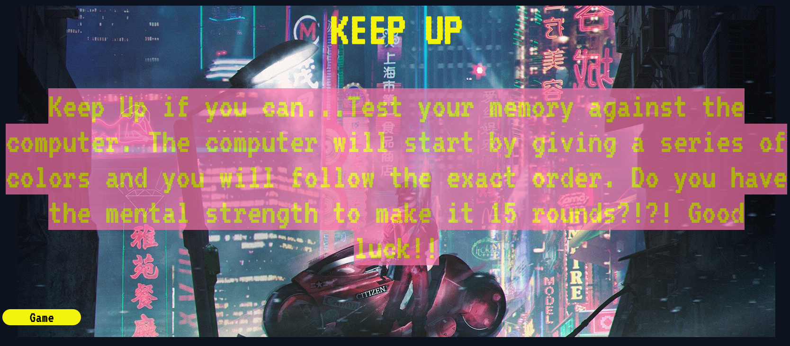

# Keep-Up

## Overview

This game is my first project for GA SEI course. After a month of hair pulling and many many breakdowns, I got my first shot at showing off what I've learned so far. My initial idea for this game was a retro 80's look of the **Simon game**. 


I drew inspiration for the styling from the movie **Drive**. 


Always loved the color and design of it and tried to reflect as much as possible in the design of the page. Another source of inspiration was the cult classic anime film **Akira**.

 I used an image from a gallery I found by Yorokobe Shounen as the background for the game board.

## Installation

None is required. The game is hosted on this website:
[KEEP UP!](alexjbustillos.github.io)

If you would like to contribute to the game you can also **fork** and **clone** the repo in your terminal using this link:
```
git clone https://github.com/AlexJBustillos/Keep-Up.git
```

## Development

This is a **player vs AI** game mode for the moment. It starts with the instructions on the page of how to play the game and on the bottom left of the screen is the game button which takes you to the game board.


This is the gameboard.

When you turn the game on the board lights up and you can start the game by pressing the start game button.


```HTML
<div class="board">
    <div class="block" id="teal"></div>
    <div class="block" id="pink"></div>
    <div class="block" id="purple"></div>
    <div class="block" id="orange"></div>
</div>
```
This was my game board. I put each block of color with its own **id**
This made it easier to do the styling for the game and add the glow effect for each color.

```CSS
.block {
    border-radius: 32px;
    height: 225px;
    width: 225px;
    transform: rotateZ(45deg);
    
}
```
I used the transform propery for each block in order to get the effect I wanted on the board.

## Logic

```Javascript
clearColor = () => {
    teal.classList.remove('glow-teal');
    pink.classList.remove('glow-pink');
    purple.classList.remove('glow-purple');
    orange.classList.remove('glow-orange');
}
flashColor = () => {
    teal.classList.add('glow-teal');
    pink.classList.add('glow-pink');
    purple.classList.add('glow-purple');
    orange.classList.add('glow-orange');
}
```
This was my favorite piece of code for the **Javascript** because it helped me be able to turn the lights on and off throughout the code without having to hardcode this constantly.

```Javascript
play = () => {
    win = false;
    computerArray = [];
    playerArray = [];
    flash = 0;
    intervalId = 0;
    turn = 1;
    turnCounter.textContent = 1;
    good = true;
    for (i = 0; i < 15; i++) {
        computerArray.push(Math.floor(Math.random() * 4) + 1);
    }
    compTurn = true;

    intervalId = setInterval(gameTurn, 800)
};
```
This **Play Function** is what starts the game. It sets all my variables up and pushes the random array for the computer by creating a string of 15 numbers from 1-4. Each of those numbers is assigned a color and sound 
```Javascript
one = () => {
    let audio = document.getElementById('forTeal');
    audio.play();
    teal.classList.add('glow-teal');

}
two = () => {
    let audio = document.getElementById('forPink');
    audio.play();
    pink.classList.add('glow-pink');
}
three = () => {
    let audio = document.getElementById('forPurple');
    audio.play();
    purple.classList.add('glow-purple');
}
four = () => {
    let audio = document.getElementById('forOrange');
    audio.play();
    orange.classList.add('glow-orange');
}
```


# Requirements
- [x] Alex Bustillos	
- [x] Keep Up
- [x] https://github.com/AlexJBustillos/Keep-Up
- [x] https://alexjbustillos.github.io	
- [ ] Regrade	
- [ ] Status	
- [x] Game is playable	
- [x] Game is multiplayer 
(or AI or PVE)
- [x] Game is winnable	
- [x] Winner/score is displayed (NO ALERTS)	
- [x] Has directions - how to play	
- [ ] Readme.md included and filled out	
- [x] Appropriate Use of GitHub (`commits`) 	- [ ] Deployed on Github Pages	
- DRY (Do Not Repeat Yourself) Code, Good Code Style	
- [x] Effort Put into Styling	
- [x] Reset button	
- [x] Good collision detection/event triggers